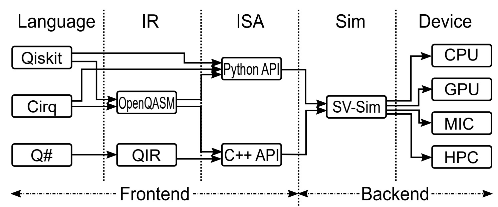

# SV-Sim: State Vector Quantum Circuit Simulation Environment

A State Vector Quantum Simulation Environment based on PGAS model for single-GPU/CPU, single-node-multi-GPUs/CPUs and multi-nodes GPU/CPU clusters. It supports Intel/AMD/IBM CPUs, NVIDIA/AMD GPUs and Xeon-Phi. It has been tested on OLCF Summit and Spock, ALCF Theta, NERSC Cori, DGX-2 and DGX-A100. Please see our SuperComputing (SC-21) [paper](doc/paper_sc21.pdf) for details. 



## Current version

Latest version: **1.0**

SV-Sim is under active development. Please propose any bugs and suggest any features. We will continuously add new features. Questions and suggestions are welcome.


## About SV-Sim

SV-Sim is a C++/CUDA/HIP implementation for simulating generic quantum circuits through state-vector on single CPU/GPU/Xeon-Phi, single-node-multi-CPUs/GPUs, and multi-node CPU/GPU cluster. As shown in the figure, SV-Sim provides Python/C++ interface. It supports Qiskit, Cirq, Q# as the front-end. It supports OpenQASM and QIR as the intermediate representation. SV-Sim relies on PGAS-based SHMEM model for communication, this includes (1) GPUDirect Peer-to-Peer for single-node multi-GPU (NVIDIA and AMD GPUs) communication; (2) OpenSHMEM for CPU multi-node communication; (3) NVSHMEM (ROC_SHMEM) for GPU multi-node communication. Please see our Supercomputing-21[paper](doc/paper_sc21.pdf) for details. 

In addition to the generic SV-Sim, this repository also includes a specialized implementation for Q# [QIR Runtime](https://github.com/microsoft/qsharp-runtime). In this tailored SV-Sim, we realize the multi-controlled gates, exponential gates, and intermediate measurement. We include dozens of applications from the [QDK samples](https://github.com/microsoft/Quantum). The svsim_qir_noise folder includes the density-matrix simulator for Q#/QIR based on the state-vector simulation for noise related simulation. We will discuss it in detail in a future paper.

## Configuration

You may need to update "CMakeLists.txt" for configuration. You need to select the front-end: C++, Python or QIR. You need to select the backend: CPU, NVIDIA GPU or AMD GPU. You need to select the mode: single, OpenMP for single-node multi-devices, or MPI/OpenSHMEM/NVSHMEM for multi-nodes cluster. You may want to enable AVX512 optimization for Xeon-Phi KNL or high-end Intel X86 CPUs. For GPU, you may need to update the compute capability (e.g., 70 for Volta and 80 for Ampere).

We provide a script "set_env.sh" for setting-up the environment on OLCF Summit HPC, and an lsf file for job submission. 

## Prerequisite
DM-Sim requires the following packages.

|  Dependency  | Version | Comments |
|:-----------: | ------- | -------- |
|     CUDA     | 11.0 or later | For NVIDIA GPU backend | 
|     GCC      | 7.0 or later  | |
|    OpenMP    | 4.0     | For single-node scale-up |
| Spectrum-MPI | 10.3    | For NVIDIA GPU cluster scale-out RDMA|
|   NVSHMEM    | 2.0.3   | For NVIDIA GPU cluster scale-out |
|  Python      | 3.4     | For Python-API |
|  Pybind11    | 2.5.0   | For Python-API |
|  mpi4py      | 3.0.3   | For Python-API cluster scale-out |
|   ROCM       | 3.1.0   | For AMD GPU backend |

The basic CPU version only requires GCC or other standard C++ compiler. It needs CUDA for NVIDIA GPU backend and ROCM for AMD GPU backend. It needs Python and PyBind11 for supporting python interface. It needs OpenSHMEM/NVSHMEM/ROC_SHMEM for CPU/NVIDIA-GPU/AMD-GPU multi-node running.

The Q#/QIR relies on LLVM-10.0 or later, and [Q# Runtime](https://github.com/microsoft/qsharp-runtime).


## Build

```text
cd svsim
mkdir build
cd build
cmake ../
```

## Build
If you use the C++ interface, you will need to develop a C++ driver program and the circuit function. Please see the adder_n10 example under the "example" folder. 

```text
./adder_n10_cpu_sin
```

If you use the Python interface, after the library is generated, you can directly execute the python script. 

```text
python adder_n10_sin.py 10
```

An example on using the Python interface is given below:
```text
import svsim_py_omp_wrapper as svsim_omp
n_qubits = 10
n_gpus = 4
sim = svsim_omp.Simulation(n_qubits, n_gpus))
sim.append(sim.X(0)) #add an X gate
sim.append(sim.H(1)) #add an H gate
sim.upload() #upload to GPU
sim.run() #run
sim.clear_circuit() #clear existing circuit
sim.append(sim.H(0)) #add a new H gate 
sim.upload() #upload to GPU
sim.run() #run new circuit on original states
res = sim.measure(10) #measure with 10 repetitions and return in a list
```

For benchmark applications, please see our [QASMBench](https://arxiv.org/abs/2005.13018) benchmakr suite, which is released [here](https://github.com/pnnl/qasmbench).

## Support Tools

We provide the tool folder for converting OpenQASM code to a python script that can be executed on SV-Sim. 


## Authors 

#### [Ang Li](http://www.angliphd.com/), Senior Computer Scientist, Pacific Northwest National Laboratory (PNNL)

#### [Sriram Krishnamoorthy](https://hpc.pnl.gov/people/sriram/), Lab Fellow, Pacific Northwest National Laboratory (PNNL)

We are currently collaborating with Bo Fang from PNNL and the Microsoft Quantum team (Chris Granade, Bettina Heim, Stefan Wernli, Robin Kuzmin, Alan Geller, Guen Prawiroatmodjo and Martin Roetteler) on implementing the pipeline from Q# to [QIR](https://devblogs.microsoft.com/qsharp/introducing-quantum-intermediate-representation-qir/) to [SV-Sim](https://github.com/microsoft/qsharp-language/blob/main/Specifications/QIR/List.md). Many thanks to their strong support.


## Citation format

Please cite our SC-21 paper:
 - Ang Li and Sriram Krishnamoorthy. "SV-Sim: Scalable PGAS-based State Vector Simulation of Quantum Circuits" In Proceedings of the International Conference for High Performance Computing, Networking, Storage and Analysis, 2021.

Bibtex:
```text
@inproceedings{li2021svsim,
    title={SV-Sim: Scalable PGAS-based State Vector Simulation of Quantum Circuits},
    author={Li, Ang and Krishnamoorthy, Sriram},
    booktitle={Proceedings of the International Conference for High Performance Computing, Networking, Storage and Analysis},
    year={2021}
}
``` 


## License

This project is licensed under the MIT License, see [LICENSE](LICENSE) file for details.

## Acknowledgments

**PNNL-IPID: 32166-E, ECCN: EAR99, IR: PNNL-SA-161181**

This project is fully supported by the [Quantum Science Center (QSC)](https://qscience.org/).The Pacific Northwest National Laboratory (PNNL) is operated by Battelle for the U.S. Department of Energy (DOE) under contract DE-AC05-76RL01830. 

## Contributing

Please contact us If you'd like to contribute to SV-Sim. See the contact in our paper or my [webpage](http://www.angliphd.com).


